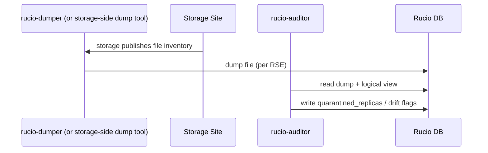
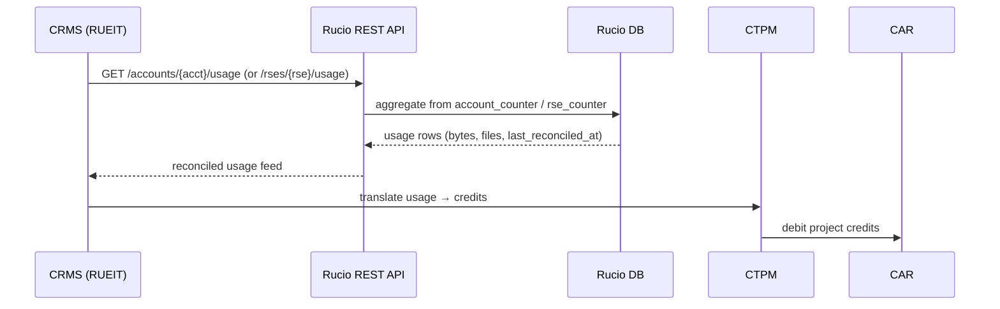
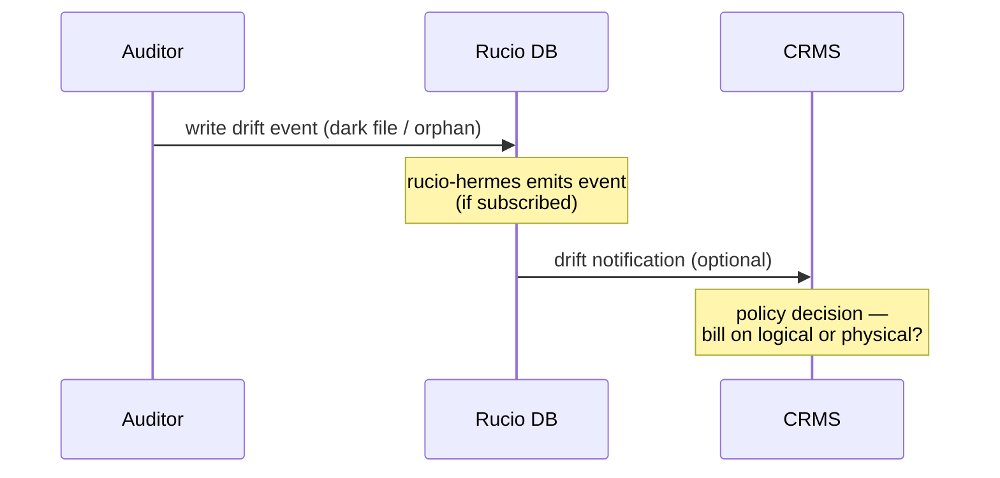

# CMS storage accounting sequence

Runtime view supporting [ADR-009](../9-adrs/adr-009-cms-storage-accounting-via-rucio.md) and [concept](../8-concepts/cms-storage-accounting.md).

## dumper-fed loop (Rucio-internal, periodic)

## CMS query (on-demand)

## Drift handling (when Auditor finds mismatch)

## What this maps to in the C4 view

The CRMS box contains CTPM, CDPM, CAR, RUEIT, API. The arrows above land on **RUEIT** (consumes Rucio data) and **CAR** (records the resulting credit movements). Rucio sits outside the CRMS boundary, in the position the C4 diagram leaves to "Compute / Data holding" peers.