# DID Creation and Replication Workflow

## Managed Upload

```mermaid
sequenceDiagram
    participant User
    participant Rucio
    participant RSE1 as RSE (source)
    participant RSE2 as RSE (destination)

    User->>Rucio: Upload files to RSE1
    Rucio->>RSE1: Upload files
    Rucio->>Rucio: Create DIDs & register replicas (RSE1)

    User->>Rucio: Create dataset & attach files
    Rucio->>Rucio: Create dataset DID & link files

    User->>Rucio: Create replication rule (dataset → RSE2)
    Rucio->>RSE2: Transfer files
    Rucio->>Rucio: Register replicas (RSE2)
```

## Manual Registration

**NOTE:**
- Each DID represents a single logical file or dataset.
- One DID can have **multiple replicas** across different RSEs.
- Replicas are physical copies; the DID abstracts the logical identity.
- Replication rules create additional replicas without changing the DID.