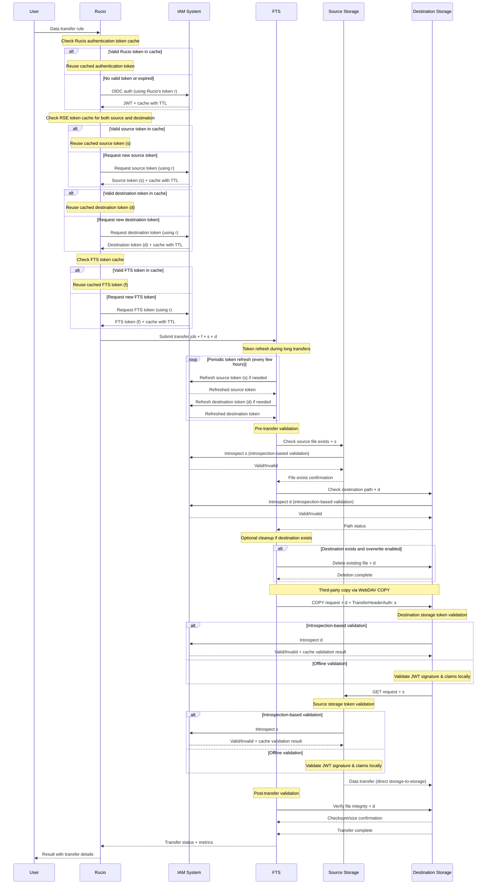
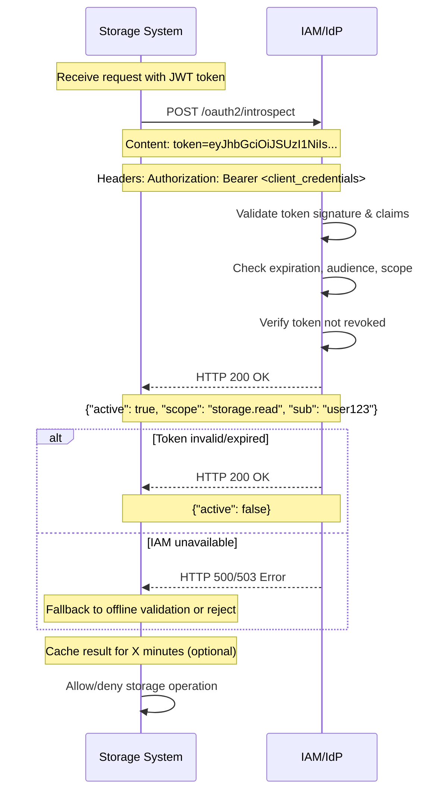
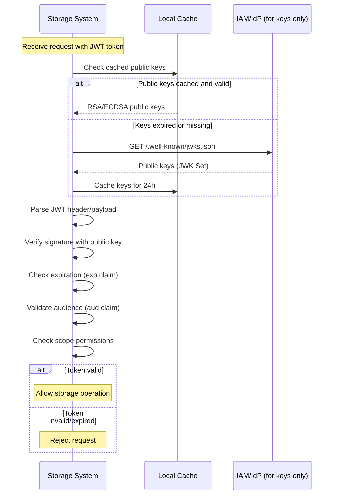

# Third-Party Copy Sequence

Refer to [Rucio Tokens Documentation](https://rucio.cern.ch/documentation/files/Rucio_Tokens_v0.1.pdf). 

Optionally, you may also refer to the following concepts for additional context: [Transfer Tool Interface](../8-concepts/transfer-tool-interface.md), [WLCG Tokens](../8-concepts/wlcg-tokens.md), [Rucio Daemons Using Transfer Tools](../8-concepts/rucio-daemons-using-transfer-tools.md), and [Storage Service Endpoints](../8-concepts/storage-service-endpoints.md). 

## Overview

Third-party copy enables direct data transfer between storage systems while FTS coordinates the transfer without data flowing through FTS itself. The workflow involves token-based authentication where Rucio orchestrates token acquisition from a centralized Identity Provider, and storage systems may validate tokens locally for optimal performance.

Third-Party Copy (TPC) sequence:

Introspection-based validation sequence:

Offline validation sequence:

## Key Components

- **Rucio**: Orchestrates the transfer workflow and manages token requests
- **Identity Provider (IdP)**: Issues OIDC/JWT tokens for authentication
- **FTS**: Transfer service that coordinates the actual copy operation
- **Storage Systems**: Source and destination endpoints that validate tokens and perform transfers

## Token Flow

1. **Rucio requests all tokens from IdP** using its own service token (r⃝) with multi-level caching
2. **Storage systems only validate tokens** - they don't issue them, but may cache validation results
3. **Three separate tokens**: FTS auth (f⃝), source read (s⃝), destination write (d⃝)
4. **All tokens are OIDC/JWT tokens** from the Identity Provider with configurable TTL

## Validation Methods

- **Offline validation**: Storage systems validate JWT signatures and claims locally using cached public keys - fastest performance
- **Introspection-based validation**: Storage queries IdP introspection endpoint for each token - creates performance bottlenecks but enables real-time revocation
- **Validation result caching**: Storage endpoints may cache validation outcomes to reduce repeated IdP queries

## Third-Party Copy Mechanism

Third-party copy enables direct data transfer between storage systems using multiple protocol implementations:

### Protocol-Specific TPC Implementations

**HTTP-TPC (WebDAV)**:
1. **FTS initiates**: Sends COPY request to destination storage with destination token (d⃝)
2. **Token propagation**: Includes source token (s⃝) in `TransferHeaderAuthorization` header
3. **Direct transfer**: Destination storage validates both tokens and directly retrieves data from source

**Other TPC Protocol Implementations** (not depicted in the sequence diagram):

**GridFTP-TPC**: Enables direct transfers between GridFTP endpoints using parallel data streams. FTS coordinates the operation while data flows directly between storage systems, delivering high throughput for large scientific datasets.

**XRootD-TPC**: Provides native third-party copying within the XRootD ecosystem using the `root://` protocol. This approach minimizes latency and eliminates intermediate buffering, making it well-suited for High Energy Physics applications requiring rapid data access.

### Universal TPC Advantages

Regardless of the underlying protocol, third-party copy mechanisms deliver consistent benefits:

- **Reduced network overhead** by eliminating intermediate data hops through transfer services
- **Improved throughput** through direct storage-to-storage communication paths  
- **Enhanced infrastructure scalability** by reducing bottlenecks at transfer coordination points
- **Consistent security model** maintaining token-based authentication across all protocols

The availability of multiple TPC implementations allows the scientific computing infrastructure to match transfer protocols with specific storage technologies and performance requirements, while preserving the fundamental efficiency gains of direct endpoint communication.

### Caching Strategy

**Multi-level token caching** reduces Identity Provider load and improves performance across the federated infrastructure:

- **Rucio Server Cache**: Stores RSE and FTS tokens with TTL-based expiration
- **Client-side Cache**: Rucio CLI and API clients maintain local token stores  
- **Storage Endpoint Cache**: Validation results cached to minimize IdP introspection calls
- **FTS Token Management**: Automatic refresh of long-lived transfer tokens

**Trade-offs**: Aggressive caching improves performance but may delay permission revocation propagation. Cache TTL configuration balances responsiveness with system load.