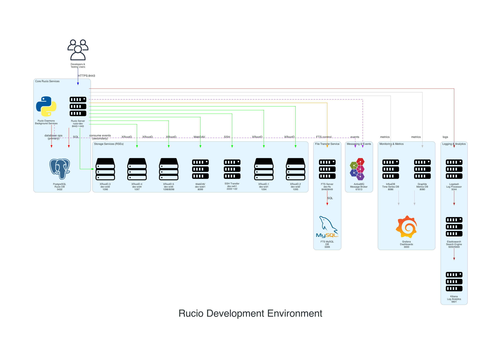

# Rucio Development Environment Deployment

## Overview

This diagram visualizes the complete Rucio development environment as deployed using the standard setup, providing a comprehensive testing and development platform for Rucio data management system.



## Usage

```bash
# Generate the deployment.png deployment diagram seen above
pip install diagrams
python3 deployment.py
```

This creates a visual representation of the development environment, useful for:
- **Onboarding**: Understanding the complete Rucio ecosystem and daemon coordination patterns
- **Development**: Identifying service dependencies and database-centric communication patterns
- **Troubleshooting**: Visualizing data flow and integration points
- **Documentation**: Providing architectural context for development teams

## Architecture Components

### Core Services
- **Rucio Server**: Main application server (port 8443→443)
- **PostgreSQL**: Central database for Rucio metadata and daemon coordination (port 5432)
- **Rucio Daemons**: Background services that coordinate via database operations

### Storage Ecosystem (RSEs)
- **XRootD Cluster**: Five XRootD servers (ports 1094-1098) providing distributed storage access
- **WebDAV**: HTTP-based file access (port 8099)
- **SSH Transfer**: SFTP/SCP endpoint (port 2222→22)

### Transfer Infrastructure
- **FTS3**: File Transfer Service for reliable data movement (ports 8446/8449)
- **MySQL**: Backend database for FTS operations (port 3306)

### Daemon Communication Architecture
**Database-Centric (Primary):**
- **Judge Services**: Read/write rule tables, replica states, and transfer requests
- **Conveyor Services**: Update transfer status and replica metadata in database tables
- **Maintenance Services**: Query and update replica lifecycle information via SQL operations
- **Coordination**: Daemons communicate through shared database state using polling patterns

**Messaging (Secondary/Specific Use Cases):**
- **ActiveMQ**: Message broker for real-time events and external notifications (port 61613)
- **External Notifications**: Hermes publishes events to monitoring systems and email
- **Real-time Events**: Transfer completion notifications and file access traces
- **Cache Operations**: Volatile replica state synchronization via message queues

### Observability Stack
**Monitoring:**
- **InfluxDB**: Time-series metrics storage (port 8086)
- **Graphite**: Alternative metrics backend (port 8080)
- **Grafana**: Unified dashboards and visualization (port 3000)

**Logging:**
- **Logstash**: Log aggregation and processing (port 5044)
- **Elasticsearch**: Search and analytics engine (ports 9200/9300)
- **Kibana**: Log exploration and analysis (port 5601)

## Key Features

### Multi-Protocol Storage
The environment supports diverse storage protocols commonly used in research computing:
- **XRootD**: High-performance distributed access
- **WebDAV**: Standard HTTP-based file operations  
- **SSH/SFTP**: Traditional secure file transfer

### Database-Driven Coordination
- **Shared State**: Daemons coordinate through database table updates rather than direct messaging
- **Polling Model**: Services monitor database changes for work coordination
- **Event Publishing**: Secondary messaging for external system notifications and real-time events

### Complete Transfer Workflow
- **Third-party transfers**: FTS3 integration for site-to-site data movement
- **Protocol translation**: Seamless access across different storage systems
- **Transfer monitoring**: Real-time visibility into data movement operations

### Production-Like Monitoring
- **Dual metrics backends**: Support for both modern (InfluxDB) and traditional (Graphite) systems
- **Comprehensive logging**: Full ELK stack for troubleshooting and analysis
- **Event tracking**: ActiveMQ integration for external notifications and specific real-time events

## Reference

For deployment instructions, see the [Rucio Documentation - Setting up Demo Environment](https://rucio.github.io/documentation/operator/setting_up_demo#using-the-standard-environment).

---

*This development environment provides a realistic testing platform that mirrors production Rucio deployments while remaining suitable for laptop/workstation development. The architecture emphasizes Rucio's database-centric coordination model with supplementary messaging for specific use cases.*