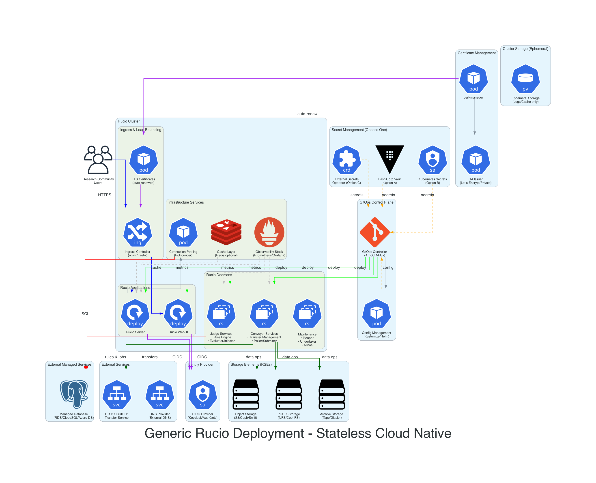

# Proposed Generic Rucio Deployment Architecture

## Overview

A cloud-native, vendor-agnostic deployment approach designed for broader community adoption while maintaining operational excellence.



## Architecture Components

### GitOps Control Plane
- **GitOps Controller**: ArgoCD or Flux for declarative deployments
- **Configuration Management**: Helm + Kustomize for multi-environment support
- **Flexible Secret Management**: Multiple options (Vault, K8s Secrets, External Secrets Operator)

### Cluster Design (Stateless)
**Core Rucio Services:**
- **Rucio Server**: REST API with standard Kubernetes Service (ClusterIP)
- **Rucio Auth**: Authentication service supporting generic OIDC providers
- **Rucio WebUI**: Configurable branding and identity integration
- **Rucio Daemons**: Horizontally scalable background processing

**Cloud-Native Infrastructure:**
- **Ingress Controller**: nginx/traefik for external traffic routing
- **cert-manager**: Automated TLS certificate lifecycle (Let's Encrypt/Private CA)
- **External DNS**: Provider-agnostic DNS automation
- **Connection Pooling**: PGBouncer for database efficiency

### External Managed Services
- **Database**: Cloud provider managed PostgreSQL (RDS, CloudSQL, Azure Database)
- **Storage**: Cloud-agnostic object storage (S3, GCS, Azure Blob, Ceph)
- **Identity Provider**: Generic OIDC (Keycloak, Auth0, Okta, etc.)
- **Transfer Service**: FTS3 or alternative transfer solutions

### Storage Architecture (Hybrid Cloud/On-Premises)
- **Object Storage RSEs**: Cloud (S3, GCS, Azure Blob) or on-premises (MinIO, Ceph, OpenStack Swift)
- **POSIX Storage RSEs**: Traditional HPC storage (Lustre, GPFS, BeeGFS) or shared filesystems (NFS, CephFS)
- **Archive Storage RSEs**: Enterprise tape systems (dCache, XRootD) or cloud archive tiers (Glacier, Coldline)
- **High-Performance RSEs**: Site-specific optimized storage for data-intensive workloads

### Data Federation Capabilities
- **Protocol Support**: S3, WebDAV, NFS, HTTP, XRootD, GridFTP, dCache protocols
- **Third-Party Copy**: FTS3, HTTP-TPC, XRootD-TPC for efficient site-to-site transfers
- **Data Staging**: Support for hierarchical storage with automated staging policies
- **Multi-Site Access**: Unified namespace across geographically distributed storage systems

## Key Design Principles

### Stateless Cluster
- **No persistent state in Kubernetes**: Database externalized to managed services
- **Ephemeral storage only**: Logs, cache, temporary files
- **Horizontal scaling**: Add/remove pods without data migration
- **Fast disaster recovery**: Cluster recreation in minutes

### Cloud-Native Patterns
- **Standard Ingress**: TLS termination and path-based routing
- **Automated certificates**: cert-manager with ACME or internal CA
- **Flexible secrets**: Support for multiple secret management systems
- **Observability**: Prometheus/Grafana stack for monitoring

### Community Benefits
- **Provider agnostic**: Works on any Kubernetes platform
- **Reduced complexity**: No specialized infrastructure dependencies
- **Standard tooling**: Uses CNCF-graduated projects
- **Operational simplicity**: Managed database eliminates DBA overhead

## Service Architecture

```
External Traffic → Ingress → Services (ClusterIP) → Pods
GitOps → Helm Charts → Kubernetes Resources
External Database ← Connection Pool ← Application Services
```

## Migration Path

Organizations can adopt incrementally:
1. **Start simple**: Kubernetes Secrets + cert-manager
2. **Add sophistication**: External Secrets Operator + Vault
3. **Scale up**: Multi-region, advanced observability

This approach removes barriers to Rucio adoption while maintaining enterprise-grade reliability and security.