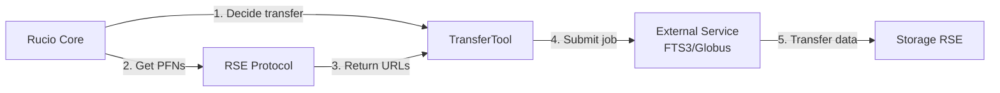
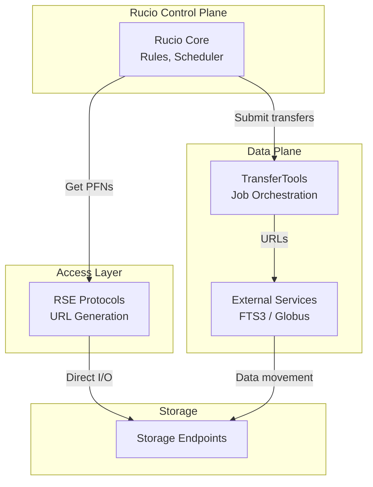

# RSE Protocols vs TransferTools

Rucio separates **logical orchestration** from **physical data movement** using two complementary layers: **RSE Protocols** and **TransferTools**.

## 1. RSE Protocols

**Location:** `rucio/rse/protocols/`

```
protocol.py, srm.py, xrootd.py, gfal.py, ngarc.py, rclone.py, ssh.py, 
posix.py, rfio.py, storm.py, webdav.py, cache.py, http_cache.py
```

### Purpose
Low-level storage endpoint access drivers

### Use Cases
- Direct client operations (`rucio upload`, `rucio download`)
- File operations: existence checks, deletion, renaming, metadata inspection
- PFN (Physical File Name) generation from LFN (Logical File Name)
- Storage backend capability detection

### Why Protocols Matter

| Function | Explanation |
|----------|-------------|
| **PFN Generation** | Protocols compute physical URLs (PFNs) from logical names (LFNs). TransferTools need these URLs. |
| **Capability Matching** | Rucio validates source/destination RSEs share compatible protocols before transfer submission. |
| **Direct Operations** | Daemons (Reaper, Dark Data Finder) use protocols directly for deletion/consistency checks. |
| **Client Access** | `rucio upload/download` commands use protocol drivers for data movement. |

> **Analogy:** Protocol = storage address; TransferTool = delivery service

### Key Limitation
Protocols **do not orchestrate** multi-RSE transfers. They operate on single endpoints only.

## 2. TransferTools

**Location:** `rucio/transfertool/`

```
transfertool.py, fts3.py, fts3_plugins.py, globus.py, globus_library.py,
bittorrent.py, bittorrent_driver.py, bittorrent_driver_qbittorrent.py
```

### Purpose
Orchestrate third-party transfers between RSEs

### Available Tools

| Tool | Use Case |
|------|----------|
| **FTS3** | Grid-native multi-source/multi-destination transfers |
| **Globus** | High-performance academic data fabric transfers |
| **BitTorrent** | Peer-to-peer replication for popular datasets |

### Responsibilities
- Schedule transfers based on replication rules
- Submit jobs to external transfer services
- Monitor transfer progress and handle retries
- Report status back to Rucio core

## 3. Interaction Model

### Control Flow



### Division of Responsibilities

| Layer | Decides | Executes |
|-------|---------|----------|
| **Rucio Core** | What/where/when to move | Rule evaluation, scheduling |
| **RSE Protocol** | How to address storage | PFN generation, local I/O |
| **TransferTool** | — | Job submission, monitoring |
| **External Service** | — | Actual data movement |

### Protocol Usage in TransferTools

**Example from FTS3:**
```python
# fts3.py (simplified)
def _file_from_transfer(self, transfer):
    return {
        'sources': [transfer.source_url(s) for s in transfer.sources],     # ← Protocol
        'destinations': [transfer.dest_url],                                # ← Protocol
    }
```

**Example from Globus:**
```python
# globus.py (simplified)
submitjob = [{
    'sources': [transfer.source_url(s) for s in transfer.sources],         # ← Protocol
    'destinations': [transfer.dest_url],                                    # ← Protocol
    'metadata': {
        'source_globus_endpoint_id': transfer.src.rse.attributes[...],     # ← RSE attr
    }
}]
```

> **Critical:** TransferTools use protocols **only for URL generation**, not for actual data movement. External services (FTS3/Globus) perform the transfer.

## 4. Architectural Summary



### Access Patterns

| Pattern | Path | When Used | Examples |
|---------|------|-----------|----------|
| **Direct Client Access** | `Client → Protocol → RSE` | User-initiated operations | `rucio upload/download` |
| **Third-Party Copy** | `Daemon → TransferTool → External Service → RSE` | Replication rules, bulk transfers | `conveyor-submitter` → FTS3/Globus |
| **Daemon Direct Access** | `Daemon → Protocol → RSE` | Administrative operations | `reaper` (deletion), `auditor` (dumps) |

## Summary

- **RSE Protocols** = Storage drivers (address generation, local I/O)
- **TransferTools** = Orchestrators (job submission, external service wrappers)
- **External Services** = Workers (actual data movement: FTS3, Globus)
- **Protocols are used by TransferTools** indirectly for PFN generation, not data transfer