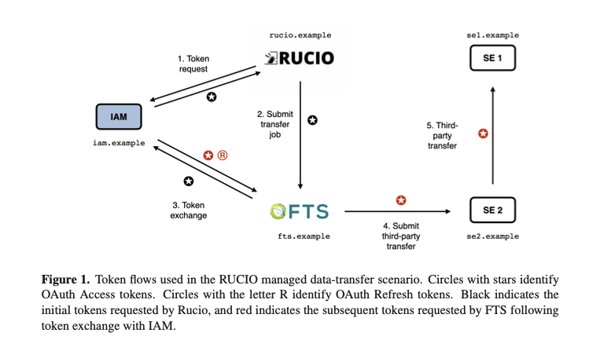

Ideally checkout previous concept on [rucio-daemons-using-transfer-tools](./rucio-daemons-using-transfer-tools.md).

---

# WLCG Tokens

## Token Schema and Specification

The token schema follows the [WLCG Common JWT Profile v1.1](https://github.com/WLCG-AuthZ-WG/common-jwt-profile/blob/master/v1.1/profile.md), for example:

### Example Access Token with Authorization Scopes

```json
{
    "sub": "e1eb758b-b73c-4761-bfff-adc793da409c",
    "iss": "https://demo.scitokens.org",
    "nbf": 1555059791,
    "wlcg.ver": "1.0",
    "aud": "https://dteam-test-client.example.org",
    "exp": 1555060391,
    "iat": 1555059791,
    "jti": "aef94c8c-0fea-490f-9027-ff444dd66d8c",
    "scope": "storage.read:/dir storage.create:/dir/datasetA compute.create",
    "eduperson_assurance": [
      "https://refeds.org/assurance/profile/espresso"
    ],
    "acr": "https://refeds.org/profile/mfa"
}
```

* **Role:** Defines the WLCG Common JWT Schema v1.0, specifying the format and claims of tokens used across WLCG services.
* **How it works:** Standardizes token structure, lifetime, and semantic conventions, enabling middleware components to issue and validate OAuth2.0 JWT tokens.
* **Purpose:** Ensures uniform tokens tailored to WLCG-specific needs, such as including group membership or roles for authorization.

---

The primary reference document on WLCG Token Usage and Discovery is available [here](https://cds.cern.ch/record/2813819/files/document.pdf). A brief summary is provided below:

## Token Authorization Flows

* **Role:** Describes OAuth2.0-based authorization flows adapted for WLCG use cases.
* **Examples:**

  * Client Credentials flow for service-to-service token issuance.
  * Token Exchange for delegated access.
  * Device Code flow to support command-line interfaces.
* **Purpose:** Provides secure and flexible token issuance and delegation mechanisms for both users and services.

## Rucio-FTS-Storage Elements Flow



* **Role:** Demonstrates token usage in real-world data transfer workflows.
* **How it works:**

  * Rucio requests an access token scoped for FTS (File Transfer Service).
  * FTS exchanges this token for tokens scoped to specific storage elements.
  * Storage tokens authorize the actual data movement between endpoints.
* **Purpose:** Illustrates multi-step token delegation enabling secure, fine-grained access control across multiple services.


## Token Discovery Mechanism

* **Role:** Defines how CLI tools and clients locate and use tokens transparently.
* **Method:** Searches for bearer tokens in environment variables, configuration files, or well-known filesystem paths in a prioritized manner.
* **Purpose:** Simplifies user experience by enabling tools to find and use valid tokens without manual intervention.

# Summary of Operation Flow

1. **Token schema** standardizes token format and claims for WLCG.
2. **OAuth2 flows** provide secure token issuance, delegation, and refresh capabilities.
3. **Rucio delegates tokens to FTS,** which obtains scoped storage tokens for authorized transfers.
4. **CLI tools discover tokens** via environment or filesystem to perform authenticated actions.

# Status and Outlook

* The document and associated specifications represent a **work in progress** with active development and refinement.
* The WLCG community is transitioning away from legacy X.509 certificate-based authentication towards modern token-based authorization.
* Production-level token issuers, workflows, and client integrations are being deployed and tested with the aim of stable production usage.
