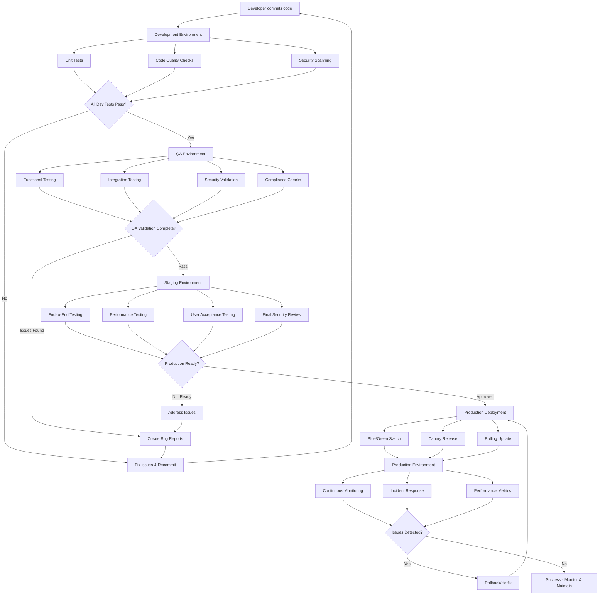
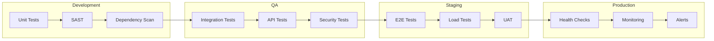

# architecture-docs

## Summary

This repository contains unofficial architecture documentation on the Rucio project.
Its primary goal is to provide a minimal and focused understanding of the system (building blocks, communication between components and systems, relevant cross-cutting concepts, etc.). It is intended as a lightweight reference to support personal comprehension and quick lookup, rather than as a comprehensive or authoritative source.

## References

- [What is Rucio?](https://rucio.github.io/documentation/started/what_is_rucio)
- [Rucio daemons](https://rucio.github.io/documentation/started/main_components/daemons)
- [Rucio Project Structure](https://rucio.github.io/documentation/developer/project_structure)
- [arc42 overview](https://arc42.org/overview)
- [Markdown Architectural Decision Records](https://adr.github.io/madr/)

## Preconditions

### 1. Install Python dependencies

```bash
pip install diagrams
```

### 2. Install Graphviz

**macOS:**

```bash
brew install graphviz
```

**Ubuntu/Debian:**

```bash
sudo apt-get install -y graphviz
```

**Windows (using Chocolatey):**

```bash
choco install graphviz
```

## arc42 chapters

TODO(mgajek-cern): Eventually setup Jekyll based project or use other static site generator tool 

### 1. Introduction and Goals

See [What is Rucio?](https://rucio.github.io/documentation/started/what_is_rucio)

### 2. Constraints

[Overview of constraints influencing the architecture can be found here](./2-constraints/architecture-constraints.md)

### 3. Context & Scope


| Name | Type | Description |
| --- | --- | --- |
| Rucio | Internal System | Scientific data management framework providing declarative policy-based data organization, transfer, and lifecycle management across distributed heterogeneous storage infrastructure |
| Workflow Management Systems | External System | Job and task orchestration platforms including HPC clusters with batch scheduling systems, container orchestration, scientific workflow engines and data preparation pipelines  that coordinate with Rucio for data availability, computational processing, and output registration |
| Authentication Systems | External System | Identity and access management services providing user authentication and authorization through various protocols and credential mechanisms, including federated multi-issuer token services |
| Storage Systems | External System | Heterogeneous storage backends including traditional filesystems, object storage, tape archives, cloud storage and external data repositories |
| Monitoring Systems | External System | Analytics and observability platforms that collect, process, and visualize system performance metrics, usage statistics and operational health data |
| Logging Systems | External System | Centralized logging infrastructure that aggregates, stores, and provides search capabilities for system events, audit trails, and troubleshooting information |
| Data Discovery Systems | External System | Catalogue and metadata federation services including ESGF Search, FAIR Data Points, and domain-specific discovery interfaces that enable cross-repository data location and metadata harmonization |
| Database Systems | External System | Transactional relational database management systems that serve as the persistence layer for catalog metadata, system state, and configuration data, including FAIR Data Points providing standardized metadata and data discovery services |
| Transfer Systems | External System | Data movement services and protocols that handle the physical transfer of files between storage endpoints with reliability, scheduling and error handling capabilities |
| Messaging Systems | External System | Messaging services that enable asynchronous communication between distributed components, supporting event-driven architectures, decoupling, reliable message delivery and catalogue change notifications to external applications |
| ~~Caching Systems~~ | ~~External System~~ | ~~High-speed data stores that temporarily hold frequently accessed data to reduce latency, decrease load on primary data sources, and improve overall system performance through intelligent data placement algorithms~~ |
| Email Systems | External System | SMTP-based notification services that deliver system alerts, status updates, operational notifications, and administrative communications to users and operators for workflow management and incident response |

---

[Stakeholder details are provided here](./3-scope-and-context/stakeholders.md)

### 4. Solution strategy

For comprehensive information about the solution strategy refer to following [markdown file](./4-solution-strategy/solution-strategy.md)

### 5. Building Block views

#### Lvl 1


| Name | Type | Description |
| --- | --- | --- |
| REST API | Internal Component | HTTPs interface providing programmatic access to Rucio functionality through standardized endpoints for authentication, data management, and system operations |
| Web UI | Internal Component | Javascript-based web user interface for browser-based interaction with Rucio services |
| Client CLIs | Internal Component | User command-line tools (bin/rucio and bin/rucio-admin) that interact with Rucio through the REST API for data operations like upload, download, and management |
| Daemon CLIs | Internal Component | System administration command-line tools where each daemon has a corresponding CLI application that bypasses the API and accesses the database directly with the same logic as daemon processes |
| Daemons | Internal Component | Background processes that orchestrate data management through a database-driven workflow pipeline, handling asynchronous tasks like rule evaluation, data transfers, and cleanup operations |
| Log Collector | External System | Centralized logging infrastructure that aggregates and forwards logs from Rucio components through polling, file monitoring, or direct ingestion; provides storage and search capabilities for system events, audit trails, and troubleshooting information |
| Rucio | Internal System | Scientific data management framework providing declarative policy-based data organization, transfer, and lifecycle management across distributed heterogeneous storage infrastructure |

#### Lvl 2


See also: [Rucio Project Structure](https://rucio.github.io/documentation/developer/project_structure)

#### Lvl 3

##### Daemons

[For comprehensive information about Rucio daemons, see the official documentation](https://rucio.github.io/documentation/started/main_components/daemons)

For detailed information about which external systems each daemon communicates with, refer to the [daemon external communications analysis](./5-building-block-views/daemons.md).

Rucio daemons orchestrate data management through a **database-driven workflow pipeline** where each daemon specializes in a specific task and communicates with others through shared database state rather than direct messaging. This creates a robust, scalable architecture:

```
Rule Created → Judge Evaluator → Conveyor Submitter → Transfer Tool → Conveyor Poller → Conveyor Finisher
```

### 6. Runtime view

#### Data Replication Workflow
1. *Client CLIs/Web UI* → *REST API*: "Create replication rule: 3 copies on different continents"
2. *REST API* → *Database*: Records the rule as a database entry
3. *Daemons* → *Database*: Query for pending rules/tasks
4. *Daemons* → *Storage/Transfer systems*: Execute the actual data operations (hours/days)
5. *Daemons* → *Database*: Update completion status
6. *Daemons* → *Database*: Track transfer progress and report metrics
7. **Error path**: *Storage/Transfer systems* → *Daemons*: "Transfer failed" → Database updated with error status

#### Authentication Workflow
1. *Client CLIs/Web UI* → *REST API*: Sends login request with credentials/token
2. *REST API* → *Authentication System*: Validates credentials
3. *Authentication System* → *REST API*: Returns success/failure
4. *REST API* → *Client CLIs/Web UI*: Issues session/token if valid
5. **Error path**: If validation fails → *REST API* → *Client CLIs/Web UI*: "Authentication denied"

#### Data Query Workflow
1. *Client CLIs/Web UI* → *REST API*: Requests dataset metadata
2. *REST API* → *Database*: Retrieves dataset info
3. *Database* → *REST API*: Returns query result
4. *REST API* → *Client CLIs/Web UI*: Sends dataset details back to user
5. **Error path**: If dataset not found → *Database* → *REST API* → *Client CLIs/Web UI*: "Dataset not found"

#### Database Migration Workflows

The database migration workflows can be found in following [markdown file](./6-runtime-view/db-migration-workflows.md).

#### Third-Party-Copy Sequence

The Third-Party-Copy Sequence illustrating interactions between Rucio, FTS and two RSEs for large file transfers can be found [here](./6-runtime-view/third-party-copy-sequence.md).

### 7. Deployment view

*To be defined with stakeholders – example below.*

#### Environments

- **Development** – for active feature work and integration (typically single-node `docker-compose` or Kubernetes). Includes automated code quality checks, security scanning, and unit testing to catch issues early.
- **QA** – functional, integration, and security testing with controlled datasets. Validates feature requirements and security standards before promotion to staging.
- **Staging** – production-like environment for final acceptance, performance, and security validation. Serves as the final checkpoint before production deployment.
- **Production** – live operational environment with appropriate redundancy, continuous monitoring, and incident response capabilities.

Based on industry best practices from:
- [CDF Best Practices - CI/CD](https://bestpractices.cd.foundation/)
- [NIST DevSecOps Practices](https://www.nccoe.nist.gov/projects/secure-software-development-security-and-operations-devsecops-practices)

**Environment Flow Activity Diagram**



**Key Testing Gates**



#### Deployment strategies

Modern deployment approaches ensure safe, reliable software releases:

- **Blue-Green Deployments** – maintain two identical environments, switching traffic after validation
- **Canary Releases** – gradual rollout to subset of users with monitoring and rollback capabilities  
- **GitOps** – infrastructure and deployments managed through version control for consistency and traceability

Security validation and policy enforcement are integrated throughout the deployment pipeline.

#### Ephemeral environments

**Preview environments** are automatically created for feature branches and pull requests, enabling early stakeholder feedback and isolated testing without environment conflicts. These temporary environments are provisioned and destroyed based on development lifecycle needs.

Learn more: [What is an ephemeral environment?](https://ephemeralenvironments.io)

#### Development environment – Single Node (docker-compose)

For comprehensive information about the deployment view refer to diagrams in following [directory](./7-deployment-view/local-docker-compose/).

#### Development, QA, Staging and Production environments - Multi-Node (Kubernetes)

For comprehensive information about the deployment view refer to diagrams in following directories:

- [Current CERN-Specific Implementation](./7-deployment-view/rucio-k8s-sme/)
- [Proposed Generic Cloud-Native Approach](./7-deployment-view/rucio-k8s-sme-community-focused/)

#### Production environments - Multi-Site (Kubernetes Federation)

TODO(mgajek-cern): add diagram, links, some content

### 8. Crosscutting concepts

Refer to [Accounting and quota web page](https://rucio.github.io/documentation/started/concepts/accounting_and_quota) and subsequent sections. Also checkout newly added [concepts here](./8-concepts).

### 9. Architectural decisions

For comprehensive information about the architectural decision refer to following [folder with markdown files](./9-adrs/)

### 10. Quality requirements

[Overview of quality requirements with SLA/SLO/SLI framework can be found here](./10-quality-requirements/quality-requirements.md)

This section defines measurable quality requirements using Service Level Agreements (SLAs), Service Level Objectives (SLOs), and Service Level Indicators (SLIs) to ensure system reliability, performance, and maintainability standards.

### 11. Risks & technical debt

TODO(mgajek-cern): Add links if existing

### 12. Glossary

TODO(mgajek-cern): Add links if existing

#### Testing definitions for different environments

- **Functional/API testing** – verifies each feature or API behaves as expected.
- **Regression testing** – re-runs existing tests automatically on code changes to catch breaks early.
- **Integration testing** – verifies components/services interact correctly.
- **Acceptance testing** – final check that system meets business and security requirements before release.
- **Load testing** – measures performance under expected or heavy usage.
- **Security testing** – includes static analysis, vulnerability scans, penetration tests, and compliance validation across environments.
- **Release validation** – confirms the build is correct, stable, secure, and production-ready.

#### SLA/SLO/SLI Framework

- **SLA (Service Level Agreement):** External commitments to users/customers (e.g., 99.9% uptime)
- **SLO (Service Level Objective):** Internal targets to meet SLAs (e.g., 99.95% uptime target)
- **SLI (Service Level Indicator):** Measurable metrics that track SLO performance (e.g., actual uptime percentage)

